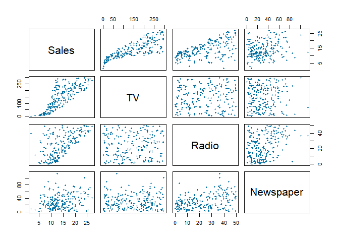

---
output: 
  html_document:
    keep_md: true
---


```r
# Import packages
library(tidyverse)
```

```
## -- Attaching packages ----------------------------------------------------------------------------------------------------------------------------------------- tidyverse 1.3.0 --
```

```
## v ggplot2 3.2.1     v purrr   0.3.3
## v tibble  2.1.3     v dplyr   0.8.3
## v tidyr   1.0.0     v stringr 1.4.0
## v readr   1.3.1     v forcats 0.4.0
```

```
## -- Conflicts -------------------------------------------------------------------------------------------------------------------------------------------- tidyverse_conflicts() --
## x dplyr::filter() masks stats::filter()
## x dplyr::lag()    masks stats::lag()
```

```r
library(readxl)

# load the data from working directory
Advertising = read_csv("C:/Users/Hugues Nelson/OneDrive - UMBC/HUGUES/Fall 2019/CMSC 491 - DS/CourseDataSets/Advertising.csv")
```

```
## Parsed with column specification:
## cols(
##   Sales = col_double(),
##   TV = col_double(),
##   Radio = col_double(),
##   Newspaper = col_double()
## )
```

```r
# Fit the full model, using all three predictor variables
FullModel = lm(Sales ~ TV + Radio + Newspaper, data = Advertising) #sales = β0 + β1 × TV + β2 × Radio + β3 × Newspaper

## F-Test: Is At Least One Predictor Related to the Response Variable?
summary(FullModel)
```

```
## 
## Call:
## lm(formula = Sales ~ TV + Radio + Newspaper, data = Advertising)
## 
## Residuals:
##     Min      1Q  Median      3Q     Max 
## -8.8277 -0.8908  0.2418  1.1893  2.8292 
## 
## Coefficients:
##              Estimate Std. Error t value Pr(>|t|)    
## (Intercept)  2.938889   0.311908   9.422   <2e-16 ***
## TV           0.045765   0.001395  32.809   <2e-16 ***
## Radio        0.188530   0.008611  21.893   <2e-16 ***
## Newspaper   -0.001037   0.005871  -0.177     0.86    
## ---
## Signif. codes:  0 '***' 0.001 '**' 0.01 '*' 0.05 '.' 0.1 ' ' 1
## 
## Residual standard error: 1.686 on 196 degrees of freedom
## Multiple R-squared:  0.8972,	Adjusted R-squared:  0.8956 
## F-statistic: 570.3 on 3 and 196 DF,  p-value: < 2.2e-16
```

The observed F statistic in our model is displayed in the last line of the summary output below, with a value of 570.3, and a small p-value is < 2.2e-16 indicates that there is strong evidence that at least one of our predictor variables (TV, Radio, Newspaper) is related to the response (Sales). 
Once we find that at least one of our predictors is related to our response variable, we can look at our R-squared value: 0.8972. Therefore, 89% of variability in the response values (Sales) is explained by the predictor values for this model.


```r
## Partial F-Test: Are a Subset of the Predictor Variables Related to the Response?
FullModel = lm(Sales ~ TV + Radio + Newspaper, data = Advertising)
ReducedModel = lm(Sales ~ TV, data = Advertising)

# Now pass them into the anova function, with the reduced model first
anova(ReducedModel, FullModel)
```

```
## Analysis of Variance Table
## 
## Model 1: Sales ~ TV
## Model 2: Sales ~ TV + Radio + Newspaper
##   Res.Df     RSS Df Sum of Sq      F    Pr(>F)    
## 1    198 2102.53                                  
## 2    196  556.83  2    1545.7 272.04 < 2.2e-16 ***
## ---
## Signif. codes:  0 '***' 0.001 '**' 0.01 '*' 0.05 '.' 0.1 ' ' 1
```

```r
# View the Full Model Once Again
summary(FullModel)
```

```
## 
## Call:
## lm(formula = Sales ~ TV + Radio + Newspaper, data = Advertising)
## 
## Residuals:
##     Min      1Q  Median      3Q     Max 
## -8.8277 -0.8908  0.2418  1.1893  2.8292 
## 
## Coefficients:
##              Estimate Std. Error t value Pr(>|t|)    
## (Intercept)  2.938889   0.311908   9.422   <2e-16 ***
## TV           0.045765   0.001395  32.809   <2e-16 ***
## Radio        0.188530   0.008611  21.893   <2e-16 ***
## Newspaper   -0.001037   0.005871  -0.177     0.86    
## ---
## Signif. codes:  0 '***' 0.001 '**' 0.01 '*' 0.05 '.' 0.1 ' ' 1
## 
## Residual standard error: 1.686 on 196 degrees of freedom
## Multiple R-squared:  0.8972,	Adjusted R-squared:  0.8956 
## F-statistic: 570.3 on 3 and 196 DF,  p-value: < 2.2e-16
```

The Analysis of Variance Tables shows F statistic value of 272.04 and a very small p-value. With these results, we conclude that there is strong evidence that at least one of predictors estimated values is related to the response, Sales.
The observed output, the p-value=0.86 in the Newspaper variable, the Beta Test below show if reducing Newspaper would increase the accuracy of the Model.


```r
# Beta Test
FullModel = lm(Sales ~ TV + Radio + Newspaper, data = Advertising)
ReducedModelBeta3 = lm(Sales ~ TV + Radio, data = Advertising) # All but Newspaper
anova(ReducedModelBeta3, FullModel) # Remember, reduced model first
```

```
## Analysis of Variance Table
## 
## Model 1: Sales ~ TV + Radio
## Model 2: Sales ~ TV + Radio + Newspaper
##   Res.Df    RSS Df Sum of Sq      F Pr(>F)
## 1    197 556.91                           
## 2    196 556.83  1  0.088717 0.0312 0.8599
```


```r
## Multicolinearity
NewspaperLR = lm(Sales ~ Newspaper, data = Advertising)

summary(NewspaperLR)
```

```
## 
## Call:
## lm(formula = Sales ~ Newspaper, data = Advertising)
## 
## Residuals:
##      Min       1Q   Median       3Q      Max 
## -11.2272  -3.3873  -0.8392   3.5059  12.7751 
## 
## Coefficients:
##             Estimate Std. Error t value Pr(>|t|)    
## (Intercept) 12.35141    0.62142   19.88  < 2e-16 ***
## Newspaper    0.05469    0.01658    3.30  0.00115 ** 
## ---
## Signif. codes:  0 '***' 0.001 '**' 0.01 '*' 0.05 '.' 0.1 ' ' 1
## 
## Residual standard error: 5.092 on 198 degrees of freedom
## Multiple R-squared:  0.05212,	Adjusted R-squared:  0.04733 
## F-statistic: 10.89 on 1 and 198 DF,  p-value: 0.001148
```
The above summary, we get a significant p-value, indicating that Newspaper is related to Sales. 

In the code below, Radio is added to this model. Notice what happens to the p-value of Newspaper.

```r
NewsRadioLR = lm(Sales ~ Newspaper + Radio, data = Advertising)

summary(NewsRadioLR)
```

```
## 
## Call:
## lm(formula = Sales ~ Newspaper + Radio, data = Advertising)
## 
## Residuals:
##      Min       1Q   Median       3Q      Max 
## -15.5289  -2.1449   0.7315   2.7657   7.9751 
## 
## Coefficients:
##             Estimate Std. Error t value Pr(>|t|)    
## (Intercept) 9.188920   0.627672  14.640   <2e-16 ***
## Newspaper   0.006644   0.014909   0.446    0.656    
## Radio       0.199045   0.021870   9.101   <2e-16 ***
## ---
## Signif. codes:  0 '***' 0.001 '**' 0.01 '*' 0.05 '.' 0.1 ' ' 1
## 
## Residual standard error: 4.284 on 197 degrees of freedom
## Multiple R-squared:  0.3327,	Adjusted R-squared:  0.3259 
## F-statistic: 49.11 on 2 and 197 DF,  p-value: < 2.2e-16
```
The Newspaper is now non-significant which is due to the effect of multicolinearity.
Newspaper and Radio are correlated with each other, and this introduces redundancy into the multiple regression model. 
Radio is highly correlated with Sales, and Newspaper is correlated with Radio. In effect, Newspaper “takes credit” for the effect of Radio when it is used as the only predictor variable.


```r
## Finding Correlations Among Predictor Variables

pairs(Advertising, # the data frame,
pch = 20, # point type option
col = "#006EA1") # color of choice
```

<!-- -->

In the plot above, we see that there is an approximate linear relationship between Sales and all of the predictor variables, except possibly Newspaper. 
Also, notice that Radio and Newspaper appear to have a slight linear relationship.


```r
cor(Advertising)
```

```
##               Sales         TV      Radio  Newspaper
## Sales     1.0000000 0.78222442 0.57622257 0.22829903
## TV        0.7822244 1.00000000 0.05480866 0.05664787
## Radio     0.5762226 0.05480866 1.00000000 0.35410375
## Newspaper 0.2282990 0.05664787 0.35410375 1.00000000
```

The function, cor is used to confirm our visual findings by computing a correlation matrix that provides pairwise correlations of all variables in the Advertising data.
Ideally, in multiple regression we want all predictors to be highly correlated with the response variable, and not correlated with each other.
According to the results, TV(0.782) and Radio(0.576) are highly correlated with Sales, but Newspaper(0.228) is moderately correlated with Sales. 
In addition, Radio and Newspaper have a moderate correlation of 0.354. This is why Newspaper was “taking credit” for the effect of Radio in the simple linear regression where we only used Newspaper. 
While trying to find correlation among predictor variables, remove the ones that are least correlated with the response variable from the final model.
